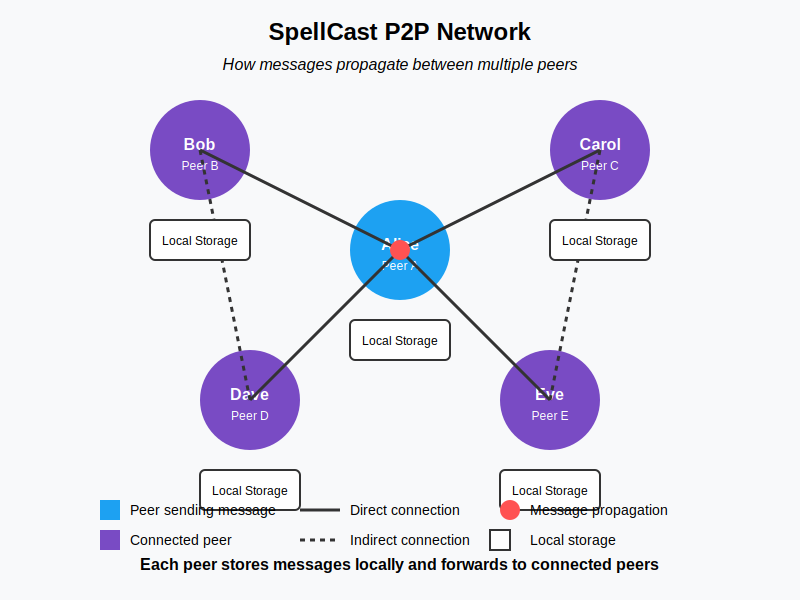

# SpellCast - Decentralized P2P Messaging

**SpellCast is a PROTOTYPE** of a fully decentralized, peer-to-peer Twitter-like application that runs entirely in your web browser. Share messages (called "spells") directly with your connections without relying on any central servers. Your data stays with you!



## Try out now!

SpellCast on itch.io: [Spellcast](https://crankgaming.itch.io/spellcast)

## Key Features

- **Fully Decentralized**: No central servers or databases - everything happens directly between peers
- **Private & Secure**: WebRTC's built-in encryption secures all peer connections
- **Browser-Based**: Runs entirely in your web browser - no installation required
- **Cross-Platform**: Works on desktop and mobile browsers (iOS, Android, iPad)
- **Persistent Storage**: Messages and connections are saved in your browser's storage
- **Offline Capable**: Create messages offline and they'll be sent when you reconnect
- **QR Code Sharing**: Connect with peers easily by scanning QR codes

## Security & Privacy

### Encrypted Communications

SpellCast leverages WebRTC's built-in security mechanisms to protect your communications:

- **DTLS (Datagram Transport Layer Security)**: All data channels between peers are encrypted using DTLS, similar to HTTPS encryption for websites
- **Peer Authentication**: During connection establishment, peers are authenticated to prevent man-in-the-middle attacks
- **No Central Points of Compromise**: Without central servers storing messages, there are no honeypots for attackers to target
- **Private Connection Model**: Messages only reach users you've directly or indirectly connected with

### Privacy Benefits

- **No Account Required**: Create an identity without providing email or phone number
- **No Tracking**: No central entity to track your connections or message content
- **Local Storage Only**: Your data is stored exclusively in your browser's local storage
- **Selective Sharing**: Messages only propagate to peers in your network

## Mobile Compatibility

SpellCast works on all modern mobile browsers:

- **iOS (iPhone & iPad)**: Works in Safari, Chrome, and Firefox
- **Android**: Compatible with Chrome, Firefox, and Samsung Internet
- **Responsive Design**: UI adapts to different screen sizes
- **Connection Persistence**: Reconnects automatically when switching networks

Note that on iOS, background tabs may disconnect due to browser limitations, but will reconnect when you return to the tab.

## Getting Started

### How to Run SpellCast

1. Clone this repository or download the files
   ```
   git clone https://github.com/SiENcE/spellcast.git
   ```

2. Open the `index.html` file in a modern web browser
   - For best results, use Chrome, Firefox, Edge, or Safari
   - You can use a local server if you prefer:
     ```
     # Using Python
     python -m http.server
     
     # Using Node.js with http-server
     npx http-server
     ```

3. That's it! SpellCast runs entirely in your browser

### Creating Your Account

1. Click the "Create New Account" button
2. Enter a username that others will see
3. Click "Generate Your Credentials"
4. Save your peer ID securely - you'll need it to log in from other devices
5. Click "Continue to App"

### Connecting with Peers

There are several ways to connect with other SpellCast users:

#### Direct Connection

1. Go to the "Connect" tab
2. Enter the peer ID of the person you want to connect with
3. Click "Connect"

#### QR Code Sharing

1. Go to your "Profile" tab to display your QR code
2. Have another SpellCast user scan your code using their device's camera
3. Alternatively, scan their QR code using a QR code scanner app

#### Reconnecting

SpellCast automatically saves your connections and will try to reconnect to known peers when you restart the app.

### Casting Spells (Sending Messages)

1. In the "Feed" tab, type your message in the text area
2. Click "Cast" to send your message
3. Your message will be sent to all connected peers and displayed in your feed

### Managing Your Connections

1. Go to the "Connect" tab to see all your connections
2. Online peers will appear at the top
3. You can disconnect from a peer by clicking the "Disconnect" button
4. Remove saved peers by clicking "Remove"

### Profile Management

1. Go to the "Profile" tab
2. Here you can see your username and peer ID
3. Share your peer ID or QR code with others to connect
4. Use the "Delete All Messages" button to clear your local message history
5. Use the "Delete Account" button to completely reset your account

## How Multi-Peer Networking Works

SpellCast creates a mesh network where:

1. **Direct Connections**: You establish WebRTC connections with peers you know
2. **Message Propagation**: When you send a message:
   - It's stored in your local browser storage
   - It's sent to all your directly connected peers
   - They store it and forward it to their peers (who aren't already connected to you)
   - The system tracks which peers have received each message to prevent duplicates
3. **Offline Handling**: If a peer is offline, messages for them are queued and sent when they reconnect

This distributed approach means there's no central point of failure, and messages can still reach their destination through alternative paths in the network.

## For Developers

### Project Structure

SpellCast is built with vanilla JavaScript and uses several key libraries:

- **PeerJS**: Handles WebRTC connections for peer-to-peer communication
- **IndexedDB**: Stores messages, media, and connection data persistently
- **QR Code JS**: Generates QR codes for easy peer ID sharing

### Key Components

The application is structured into several manager classes:

- **SpellCastApp**: Main application controller
- **UserManager**: Handles user credentials and authentication
- **PeerManager**: Manages peer connections and communication
- **TweetManager**: Handles message creation, storage, and distribution
- **UIManager**: Controls the user interface and event handling
- **StorageManager**: Manages persistent storage with IndexedDB
- **MediaManager**: -- unused, unfinished!! --
- **RateLimiter**: Prevents spam and abuse

### P2P Message Distribution System

SpellCast uses a sophisticated message distribution system:

1. When a message is created, it's stored locally and broadcast to all connected peers
2. The system tracks which peers have received which messages
3. When new peers connect, only messages they haven't seen are sent
4. This ensures efficient distribution without flooding the network

```javascript
// Simplified example of the message distribution tracking
{
  tweetRecipients: {
    "message-123": ["peer1", "peer3"], // Peers that have this message
    "message-456": ["peer1", "peer2", "peer3"]
  },
  unsentTweets: {
    "peer1": [], // This peer has all messages
    "peer2": ["message-123"], // This peer needs message-123
    "peer3": []
  }
}
```

### WebRTC Encryption

SpellCast relies on WebRTC's built-in security features:

1. **DTLS Encryption**: All data channels are encrypted using Datagram Transport Layer Security
2. **Connection Security**:
   - Each connection begins with a secure handshake
   - Communication is encrypted end-to-end between directly connected peers
   - Intermediary peers cannot read messages they relay if implemented correctly

**Remember that while the transport is secure, the application itself doesn't implement additional encryption layers. For more security, you could add end-to-end encryption at the message level.**

### Storage Architecture

SpellCast uses IndexedDB for persistent storage with a fallback to localStorage:

- **User credentials**: Username and peer ID
- **Messages**: All created and received messages
- **Media**: Images attached to messages (stored as base64 data)
- **Peers**: Known connections and their status
- **Distribution state**: Which peers have received which messages

### Connection Quality Monitoring

SpellCast actively monitors connection quality:

1. Regular pings are sent to connected peers
2. Response times are measured to determine connection quality
3. Failed connections trigger automatic reconnection attempts
4. Connection quality is displayed in the UI with simple indicators

### How to Contribute

We welcome contributions to SpellCast! Here's how you can help:

1. **Fork the repository**: Create your own copy of the project
2. **Make your changes**: Add features or fix bugs
3. **Test thoroughly**: Ensure your changes work as expected
4. **Submit a pull request**: Share your improvements with us

#### Development Setup

1. Clone the repository
   ```
   git clone https://github.com/SiENcE/spellcast.git
   ```

2. Set up a local development server
   ```
   # Using Python
   python -m http.server
   
   # Using Node.js with http-server
   npx http-server
   ```

3. Open `http://localhost:8000` (or whatever port your server uses)

4. Make changes and refresh the browser to see them

#### Coding Guidelines

- Use clear, descriptive variable and function names
- Add comments for complex logic
- Maintain the existing code structure and patterns
- Write clean, modular code
- Test your changes across different browsers

## License

This project is licensed under the Creative Commons Attribution-NonCommercial 4.0 International License - see the [LICENSE](LICENSE) file for details.

This means:
- You are free to share (copy and redistribute) and adapt (remix, transform, and build upon) this material
- You must give appropriate credit and indicate if changes were made
- You may not use the material for commercial purposes
- No additional restrictions — you may not apply legal terms or technological measures that legally restrict others from doing anything the license permits

## Acknowledgments

- [PeerJS](https://peerjs.com/) for the WebRTC implementation
- [QRCode.js](https://github.com/davidshimjs/qrcodejs) for QR code generation

---

*Cast spells, not tweets. Be decentralized.*
