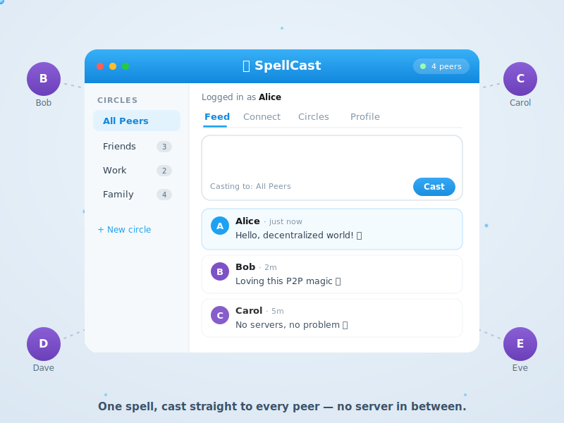

# SpellCast - Your Conversations, Nobody Else's

**Cast spells, not tweets.** SpellCast is a Twitter-like social app with **no servers, no accounts, and no company in the middle**. Your messages (called "spells") travel directly between you and the people you connect with, and everything lives in your own browser. It's a single web page - nothing to install.

> ⚠️ SpellCast is an early **prototype**. It's a genuinely working, fun way to explore serverless social messaging - just don't rely on it for anything safety-critical yet. The honest details are in the [technical notes](docs/TECHNICAL.md).

## Try it now

Try SpellCast: **[sience.github.io/](https://sience.github.io/)** - or [run your own copy](docs/TECHNICAL.md#running-locally).

## Why SpellCast?

Most social apps are free because *you* are the product. SpellCast takes the opposite approach:

- **No servers, no middleman.** There's no company database holding your posts. Messages go peer-to-peer, straight between browsers - nothing central to hack, sell, or shut down.
- **No account, ever.** No email, no phone number, no password. You pick a username, get an ID, and you're in.
- **Your data stays with you.** Posts, images, and contacts live in *your* browser - not in someone else's cloud.
- **Private by design.** No ads, no tracking, no profiling. Connections are encrypted in transit (WebRTC/DTLS), and messages only travel to people in your own network.
- **Works everywhere.** Any modern desktop or mobile browser - iPhone, iPad, Android, laptop. Connect with a friend in seconds by scanning a QR code.
- **It even works offline.** Write now; your spells send themselves when you reconnect.

## Features you'll actually use

- **Cast spells** - short posts shared instantly with everyone you're connected to
- **Spark** ✨ - cast a sparkle onto someone else's spell to show some love (a signed, peer-to-peer reaction)
- **Images & links** - attach a picture (large photos are automatically optimized to send), or drop a link and get an automatic preview (images, YouTube, websites)
- **Circles** - group your peers (Friends, Work, Family…), filter your feed by circle, and cast to just one group when you want to
- **Mesh delivery** - messages hop from friend to friend, reaching people you're not directly connected to
- **Pick up anywhere** - log back in on another device and your history syncs back from your peers
- **QR connect** - show your code, scan a friend's, and you're talking

## How to use it

### Create your identity
1. Click **Create New Account**
2. Choose a username others will see
3. Click **Generate Your Credentials** - you'll get a peer ID (your address on the network)
4. Keep that ID somewhere safe - it's how you log back in
5. Click **Continue to App**

### Connect with people
- **By QR code:** show your code from the **Profile** tab and have a friend point their **phone camera** at it — it opens SpellCast and offers to connect. Or use the **Scan QR** button on the **Connect** tab to scan theirs from inside the app.
- **By invite link:** from the **Profile** tab, tap **Share invite link** (or **Copy link**) and send it over any messenger — opening it connects them to you. No typing required.
- **By ID / link:** open the **Connect** tab and paste a peer ID *or* an invite link, then click **Connect**.
- SpellCast remembers your connections and reconnects automatically next time

### Cast a spell
1. In the **Feed**, type your message (add an image or a link if you like)
2. Press **Cast** - it's shared with your connected peers and appears in your feed
3. The little **"Casting to"** label shows where it'll go - everyone, or the circle you've selected

### Organize with Circles
Circles are your own private groups of peers - like lists.
1. Create a circle from the sidebar (**+**) or the **Circles** tab
2. In the **Circles** tab, add or remove peers
3. Click a circle in the sidebar to filter your feed to just those people
4. While a circle is selected, your casts go to that circle - pick **All Peers** to post to everyone

### Manage your stuff
On the **Profile** tab you can show your QR code, **Clean Up Storage** (remove unused images and stale data), **Delete All Messages**, or **Delete Account** to wipe everything and start fresh.

## Good to know

SpellCast is an honest prototype, so a few things are worth understanding up front:

- **Identities are cryptographically signed.** Every message is signed with a key that lives only in your browser, and your peers verify it - so impostors can't forge your posts (a key/name mismatch is flagged as "⚠ impersonator?"). Your displayed handle is `name#fingerprint`. Back up your key from **Profile → Export Identity Backup** (passphrase-encrypted) and restore it on another device from the login screen.
- Your peer ID is still your network *address and* login for now; account portability is via the encrypted identity backup file rather than re-typing the ID.
- Connections are encrypted in transit (WebRTC/DTLS). **Circle posts are additionally end-to-end encrypted** to each member's key - the broker and any intermediary only see ciphertext. **Public ("All Peers") posts are not encrypted**, since they're meant to spread across the whole mesh.
- **Metadata isn't fully private:** by default a public PeerJS broker can see peer IDs and who connects to whom (not your message content). You can [self-host the broker + TURN](docs/SELF-HOSTING.md) to keep that off third-party servers.
- Deleting a message removes it from *your* device; copies others already received may reappear when you reconnect.

The full, frank list is in the [technical notes](docs/TECHNICAL.md#known-limitations--prototype-status).

## For developers

SpellCast is vanilla JavaScript with no build step. The architecture, networking internals, storage model, how to run it locally, and contribution guidelines all live in **[docs/TECHNICAL.md](docs/TECHNICAL.md)**.

## License

Creative Commons Attribution-NonCommercial 4.0 International - see [LICENSE](LICENSE).

- Share and adapt freely, with credit
- Indicate any changes you make
- Non-commercial use only

## Acknowledgments

- [PeerJS](https://peerjs.com/) - WebRTC peer connections
- [QRCode.js](https://github.com/davidshimjs/qrcodejs) - QR code generation
- [jsQR](https://github.com/cozmo/jsQR) - QR code scanning (MIT)

---

*Cast spells, not tweets. Be decentralized.*
